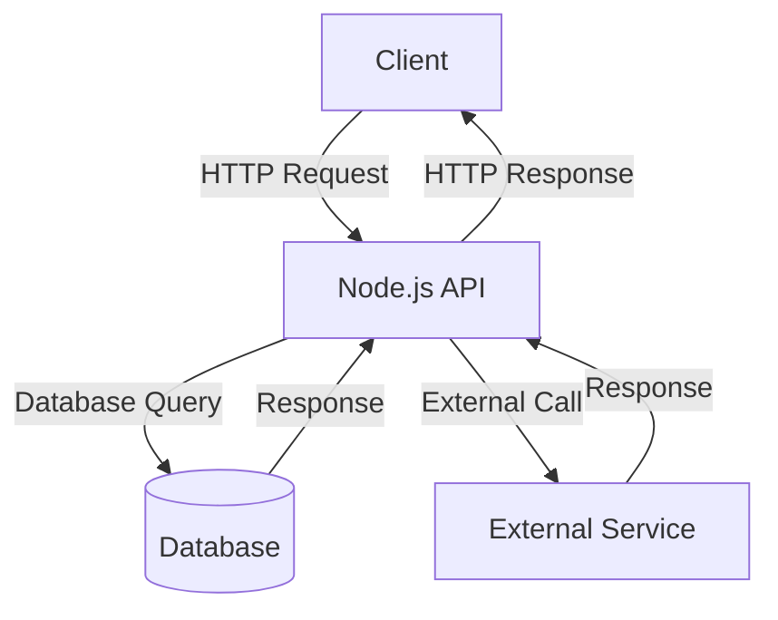
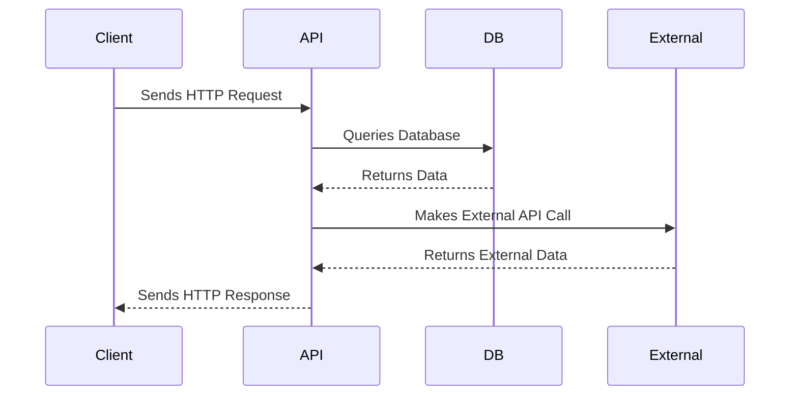

# Sample Node.js Application

This document provides an overview of a sample Node.js application, including its architecture and workflow.

## Application Architecture

The following diagram illustrates the architecture of the Node.js application:



## Workflow

The workflow of the application is depicted below:



## Features

- RESTful API built with Node.js.
- Database integration for persistent storage.
- External API calls for third-party services.

## Prerequisites

- Node.js installed on your system.
- A database (e.g., MongoDB, PostgreSQL).
- API keys for external services (if applicable).

## Getting Started

1. Clone the repository:
   ```bash
   git clone https://github.com/your-repo/sample-nodejs-app.git
   cd sample-nodejs-app
   ```

2. Install dependencies:
   ```bash
   npm install
   ```

3. Configure environment variables:
   - Create a `.env` file.
   - Add database connection strings and API keys.

4. Start the application:
   ```bash
   npm start
   ```

## Reference Links

- [Node.js Documentation](https://nodejs.org/en/docs/)
- [Mermaid Documentation](https://mermaid-js.github.io/mermaid/#/)
- [Database Integration Guide](https://www.mongodb.com/docs/)
